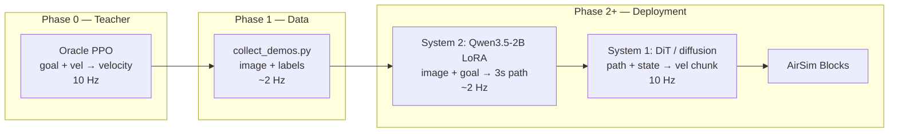

# DroneTransfer Project Handbook

Consolidated documentation for the drone navigation + VLM planner pipeline.  
**Server:** `ambus-algoq8000` · **Sim:** AirSim 1.6 Blocks (Linux) · **Updated:** Jul 7, 2026

**Visual handbook (interactive charts + architecture diagram):** open  
`canvases/drone-project-handbook.canvas.tsx` in Cursor Canvas.

---

## Executive summary

| Item | Status |
|------|--------|
| **Goal** | Dual-system stack: VLM planner (3 s path) + DiT action head (velocity chunks) |
| **Teacher** | Blind oracle PPO — Stage 1 **done** (140k steps, 100% eval) |
| **Stage 2** | Random-goal oracle — **in progress** |
| **Demo collection** | Script ready (`collect_demos.py`), not yet run at scale |
| **VLM planner** | `train_planner_qwen_lora.py` added locally, not yet trained |
| **DiT action head** | **Not built** |
| **Production sim** | AirSim 1.6 Blocks on Colosseum v2.3.0 |

---

## 1. Project goal

Train a **dual-system** drone stack:

| System | Role | Rate | Input | Output |
|--------|------|------|-------|--------|
| **Oracle (done/in progress)** | RL teacher | 10 Hz | `goal + vel` | velocity commands |
| **System 2 — VLM planner** | Trajectory planner | ~2 Hz | `image + goal + vel` | 6 waypoints / 3 s |
| **System 1 — DiT action head** | Low-level control | 10 Hz | path + state | 16-step velocity chunk |

The oracle is **blind** (no camera). It provides expert actions and hindsight paths for supervised training only — it does **not** initialize the VLM planner.

### Architecture (data flow)



### Timing diagram

```
Control loop (10 Hz, every 0.1 s):
  tick 0   1   2   3   4   5   6   7   8   9   10 ...
  act  ●   ●   ●   ●   ●   ●   ●   ●   ●   ●   ●   ...  oracle velocity
  img  ●                   ●                   ●       perception_stride=5 → ~2 Hz

Planner horizon (K=6, dt=0.5 s):
  now ──+0.5s──+1.0s──+1.5s──+2.0s──+2.5s──+3.0s──►  future_offsets[6×3]

Action chunk (H=16 @ 10 Hz):
  now ──► 1.6 s of oracle velocity labels ──►  action_chunk[16×3]
```

---

## 2. What was completed

### 2.1 Infrastructure (ambus-algoq8000)

| Resource | Value |
|----------|-------|
| OS | Ubuntu 24.04 |
| GPUs | 8× NVIDIA Quadro RTX 8000 |
| Sudo | **No** — user installs under `/tmp/c-zfann` |
| Default shell | **tcsh** → always use **`bash`** for training |
| Workspace | `/tmp/c-zfann/drone_train` |
| Colosseum | v2.3.0 at `/tmp/c-zfann/Colosseum` |
| Blocks binary | `/tmp/c-zfann/Colosseum/docker/Blocks/LinuxNoEditor/Blocks.sh` |
| AirSim version | 1.6.0-linux (Blocks.zip extracted via `python3 -m zipfile -e`) |
| RPC port | 41451 (one sim at a time) |
| settings.json | `~/Documents/AirSim/settings.json` (copied from Colosseum docker) |

**Python environment:**

```bash
export PYTHONPATH=/tmp/c-zfann/pydeps:/tmp/c-zfann/AirSim-1.6/PythonClient
python3 -c "import msgpack; print(msgpack.version)"   # must be (0, 6, 2)
python3 -c "import airsim; c=airsim.MultirotorClient(); c.confirmConnection(); print('OK')"
```

| Fix | Why |
|-----|-----|
| `msgpack==0.6.2` in pydeps | msgpack 1.x → `TypeError: encoding` on RPC |
| AirSim **1.6** PythonClient | Colosseum client mismatches AirSim 1.6 Blocks binary |
| Train from `drone_train/` | Root-owned logs in `/tmp/c-zfann/DroneTransfer` caused permission errors |
| **tmux** for sim + train | SSH disconnect kills processes; Blocks disconnect crashed grey run |

### 2.2 Oracle PPO — Stage 1 (fixed goal)

**Training config:**

| Parameter | Value |
|-----------|-------|
| Mode | `--mode oracle` |
| Backend | `--sim-backend airsim` |
| Goal (NED) | `(20, 0, -10)` m |
| Target steps | **140,000** |
| Checkpoint | `checkpoints/oracle/ppo_oracle_final_140000.zip` |
| Policy input | 6-dim: relative goal (3) + body velocity (3) |
| Control rate | 10 Hz |
| Max episode steps | 500 |

**TensorBoard runs:**

| Run | Color | Steps | Wall time | Outcome |
|-----|-------|-------|-----------|---------|
| PPO_1 | Grey | ~37,000 | ~1.1 hr | **Crashed** — Blocks disconnect / `TransportError`, value loss spike |
| Current | Cyan | ~132k–140k | ~12.5 hr | **Converged** — ~9 iterations/s |

**Convergence metrics (~132k steps, last 100 episodes):**

| TensorBoard metric | Value |
|--------------------|-------|
| `episode/success_rate` | **1.0** |
| `episode/collision_rate` | **0** |
| `episode/timeout_rate` | **0** |
| `episode/stuck_rate` | **0** |
| `rollout/ep_rew_mean` | **~119** |
| `rollout/ep_len_mean` | **~42** |

**Approximate learning curve (ep_rew_mean vs steps):**

| Steps | ep_rew_mean | success_rate |
|-------|-------------|--------------|
| 0 | ~−40 | 0 |
| 15k | ~20 | 0.3 |
| 32k | ~95 | 0.85 |
| 50k | ~115 | 0.98 |
| 100k | ~118 | 1.0 |
| 132k | ~119 | 1.0 |
| 140k | ~119 | 1.0 |

**Eval results (`eval_oracle.py`, 10 episodes each):**

| Scenario | Success | Mean steps | Mean reward | Collisions |
|----------|---------|------------|-------------|------------|
| Fixed goal `(20, 0, -10)` | **10/10 (100%)** | **42.4** | **117.5** | 0 |
| New goal `(15, 10, -8)` | **10/10 (100%)** | **64.3** | **113.1** | 0 |

Episode length ~42 steps ≈ **4.2 s** at 10 Hz. Timeout rate 0 is expected when success = 100% (episodes end at goal, not 500-step limit).

### 2.3 Oracle PPO — Stage 2 (random goals) — in progress

Resume from Stage 1 checkpoint with randomized goals from `waypoints.json` (14 Blocks waypoints):

```bash
python3 train_ppo.py \
  --sim-backend airsim \
  --mode oracle \
  --randomize-goal \
  --smooth-coef 0.03 \
  --steps 640000 \
  --device cuda \
  --checkpoint checkpoints/oracle/ppo_oracle_final_140000
```

**Expected Stage 2 behavior:**

| Metric | Early after resume | Target (good) |
|--------|-------------------|---------------|
| `success_rate` | Drops from 1.0 → ~0.1–0.4 | ≥ 0.7 |
| `collision_rate` | Rises | Falls toward 0 |
| `ep_rew_mean` | Drops from ~119 | Recovers toward 100+ |
| `ep_len_mean` | More variable | Stabilizes |

### 2.4 Code added locally (DroneTransfer repo)

| File | Status | Purpose |
|------|--------|---------|
| `train_planner_qwen_lora.py` | **NEW** | Qwen3.5-2B + LoRA + `TrajectoryHead` → 6×3 waypoints |
| `QWEN_PLANNER_NOTES.md` | **NEW** | Planner training quick reference |
| `collect_demos.py` | **Modified** | `--min-future-valid` (default 4); isaac backend support |
| `PROJECT_HANDBOOK.md` | **NEW** | This document |
| `canvases/drone-project-handbook.canvas.tsx` | **NEW** | Visual interactive handbook |

**Not yet built:**

| File | Purpose |
|------|---------|
| `eval_planner_qwen.py` | Visual trajectory overlay demo |
| DiT / diffusion trainer | System 1 on `action_chunk` |
| Closed-loop deployment script | Planner @ 2 Hz + action @ 10 Hz |

### 2.5 Isaac Sim path (abandoned for now)

| Attempt | Result |
|---------|--------|
| Isaac Lab `develop` + Cartpole | Plumbing validated (SB3 + Docker) |
| Isaac Lab `main` + Quadcopter | Version mismatch with Isaac Sim 6.0 (`SoftBodyView` removed) |
| Pegasus 5.1 WebRTC | Visual viewing worked; not wired into DroneTransfer vision training |
| Isaac checkpoints | **Not compatible** with Colosseum/AirSim oracle |

**Decision:** Production path is **Colosseum/AirSim Blocks**, not Isaac.

---

## 3. Demo data schema (`collect_demos.py`)

Each `.npz` shard contains:

| Field | Shape / type | Description |
|-------|--------------|-------------|
| `image` | `(224, 224, 3)` uint8 | Front RGB — System 2 input |
| `goal` | `(3,)` float32 | Relative NED target |
| `vel` | `(3,)` float32 | Body velocity |
| `depth` | `(P, P)` float32 | Metric depth (optional label) |
| `seg` | `(P, P, 3)` uint8 | Segmentation RGB (optional label) |
| `future_offsets` | `(6, 3)` float32 | Positions at +0.5…+3.0 s minus now |
| `future_mask` | `(6,)` uint8 | 1 = valid, 0 = past episode end |
| `action_chunk` | `(16, 3)` float32 | Next 16 oracle velocity commands |
| `action_mask` | `(16,)` uint8 | Validity mask |

**Collection parameters (defaults):**

| Flag | Default | Meaning |
|------|---------|---------|
| `--perception_stride` | 5 | Capture image every 5 control ticks → **~2 Hz** |
| `--horizon-k` / K | 6 | Future waypoints |
| `--horizon-dt` | 0.5 s | Spacing between future waypoints |
| `--action-chunk-len` / H | 16 | Action labels @ 10 Hz → 1.6 s |
| `--min-future-valid` | 4 | Drop samples with too many padded future waypoints |

**Important:** `--steps` = **decision samples**, not control steps.

### Demo volume guidance

| Target | Decision samples | Est. collection time |
|--------|------------------|---------------------|
| Pipeline sanity | 5k–10k | ~1 hr |
| Accurate on Blocks | 20k–50k | ~3–7 hr |
| Very accurate Blocks | 50k–100k | ~7–14 hr |
| Multi-map generalization | 100k–300k+ | 14–40+ hr |

**Recommendation:** collect **30k–50k on Blocks** after Stage 2 oracle converges, train planner, then add outdoor maps.

---

## 4. Oracle vs VLM planner — separate training

| | Oracle PPO | Qwen planner |
|---|------------|--------------|
| Algorithm | PPO (RL) | Supervised regression + LoRA |
| Input | goal + vel (6-d) | image + goal (+ vel in prompt) |
| Output | velocity now (3-d) | 6 future waypoints (6×3) |
| Checkpoint dir | `checkpoints/oracle/` | `checkpoints/planner_qwen_lora/best/` |
| Reuse oracle weights? | — | **No** — oracle only **labels** demos |

`train_ppo.py --mode vision` (CNN) and `--mode vlm` (SigLIP) are **ablations**, not the final VLM→DiT design.

### Planner training (`train_planner_qwen_lora.py`)

| Parameter | Default |
|-----------|---------|
| Model | `Qwen/Qwen3.5-2B` |
| LoRA r / alpha | 16 / 32 |
| Loss | Masked Huber + smoothness regularizer |
| Metrics | **ADE**, **FDE** |
| Output | `adapter/` + `planner_head.pt` |

| Metric | Meaning | Good on Blocks |
|--------|---------|----------------|
| **ADE** | Average waypoint error over 3 s (m) | < 1 m usable, < 0.5 m strong |
| **FDE** | Final waypoint error only (m) | < 0.8 m strong |

---

## 5. Blocks waypoints (`waypoints.json`)

14 random-goal targets for Stage 2 (NED meters):

```
( 6, -12,  -6)   ( 6,  14,  -6)   (15, -11,  -7)   (15,   9, -6.5)
(22,   0,  -7)   (20, -20,  -6)   (25, -12,  -7)   (22,  20, -6.5)
(30,  32,  -7)   (36,  24,  -6)   (36,   4,  -7)   (36, -24, -6.5)
(42, -32,  -7)   (48,  16, -6.5)
```

Outdoor maps need **separate** waypoint files — coordinates do not transfer.

---

## 6. Multi-environment strategy

| Phase | Environment | Size | Purpose |
|-------|-------------|------|---------|
| A (now) | **Blocks** | 178 MB | Pipeline + accurate paths |
| B | **AirSimNH** | 1.56 GB | Outdoor visual diversity |
| C | **LandscapeMountains** | 677 MB | Terrain + scale |
| D (optional) | ZhangJiajie, AbandonedPark | 398 MB, 1.12 GB | Hard visuals / clutter |

**Caveat:** blind oracle may label paths through obstacles on complex maps. True obstacle-aware labels need a **privileged teacher** (depth/seg) in a later phase.

Only **one sim** on port 41451 at a time.

---

## 7. Operational runbook

### Every SSH session

```bash
bash
export PYTHONPATH=/tmp/c-zfann/pydeps:/tmp/c-zfann/AirSim-1.6/PythonClient
python3 -c "import msgpack; print(msgpack.version)"   # (0, 6, 2)
```

### tmux layout

| Session | Command |
|---------|---------|
| `blocks` | Start Blocks headless |
| `train` | `train_ppo.py` or `train_planner_qwen_lora.py` |
| `tensorboard` | Optional: `tensorboard --logdir logs/oracle/tb` |

### Start Blocks

```bash
cd /tmp/c-zfann/Colosseum/docker/Blocks/LinuxNoEditor
CUDA_VISIBLE_DEVICES=0 ./Blocks.sh -RenderOffScreen -ResX=640 -ResY=480 -NoSound
```

### Sync local repo to server

```powershell
scp -r "C:\Users\c-zfann\Documents\Drone Project\DroneTransfer\*" c-zfann@ambus-algoq8000:/tmp/c-zfann/drone_train/
```

### Collect demos (after strong oracle)

```bash
cd /tmp/c-zfann/drone_train
python3 collect_demos.py \
  --checkpoint checkpoints/oracle/ppo_oracle_final_140000 \
  --steps 50000 \
  --out data/demos \
  --min-future-valid 4 \
  --device cuda
```

### Train Qwen planner

```bash
python3 train_planner_qwen_lora.py \
  --data-dir data/demos \
  --out-dir checkpoints/planner_qwen_lora \
  --epochs 5 \
  --batch-size 8
```

---

## 8. Roadmap

```
[x] Oracle Stage 1 (fixed goal) — 140k, 100% eval
[~] Oracle Stage 2 (random goals) — in progress
[ ] Collect 30k–50k Blocks demos
[ ] Train Qwen3.5-2B LoRA planner (val ADE < 1 m)
[ ] eval_planner_qwen.py — visual trajectory demo
[ ] AirSimNH + map waypoints + 20k–30k demos
[ ] DiT / diffusion action head on action_chunk
[ ] Closed-loop: planner @ 2 Hz + action @ 10 Hz
[ ] Privileged / depth-aware teacher
```

---

## 9. Known issues & fixes

| Issue | Symptom | Fix |
|-------|---------|-----|
| msgpack 1.x | `TypeError: encoding` on connect | `pip install msgpack==0.6.2` to pydeps |
| Colosseum PythonClient | RPC mismatch with Blocks 1.6 | Use **AirSim 1.6 PythonClient** |
| tcsh + CUDA | `CUDA_VISIBLE_DEVICES` ignored | Switch to `bash` |
| Root-owned checkpoints | Permission denied | Use `/tmp/c-zfann/drone_train` |
| Blocks disconnect | Training crash ~37k steps | Run sim + train in **tmux** |
| Isaac checkpoints | Load failure on AirSim | **Not compatible** — retrain on Colosseum |
| High-freq image RPC | Drone hovers/jerks during collection | `perception_stride=5` (~2 Hz) |
| Near-episode-end demos | Padded future waypoints | `--min-future-valid 4` |

---

## 10. File index

| File | Role |
|------|------|
| `train_ppo.py` | Oracle / vision / SigLIP PPO (Stages 1–3) |
| `colosseum_nav_env.py` | AirSim gym environment |
| `collect_demos.py` | Demo dataset for VLM + DiT |
| `train_planner_qwen_lora.py` | System 2 planner training |
| `waypoints.json` | Blocks random-goal waypoints (14) |
| `QWEN_PLANNER_NOTES.md` | Planner quick reference |
| `PROJECT_HANDBOOK.md` | This consolidated handbook |
| `isaac_nav_env.py` | Isaac Lab wrapper (experimental) |
| `ISAAC_5_1_VISUAL_TRAINING.md` | Pegasus 5.1 visual notes (archived path) |

---

## 11. Glossary

| Term | Definition |
|------|------------|
| **NED** | North-East-Down coordinate frame (AirSim convention) |
| **Oracle** | Blind PPO policy trained with goal + velocity only |
| **Hindsight path** | `future_offsets` — where the drone actually flew |
| **ADE** | Average Displacement Error across K waypoints |
| **FDE** | Final Displacement Error at t = 3 s |
| **LoRA** | Low-Rank Adaptation — efficient VLM fine-tuning |
| **Privileged teacher** | Future planner using depth/seg for obstacle-aware paths |
